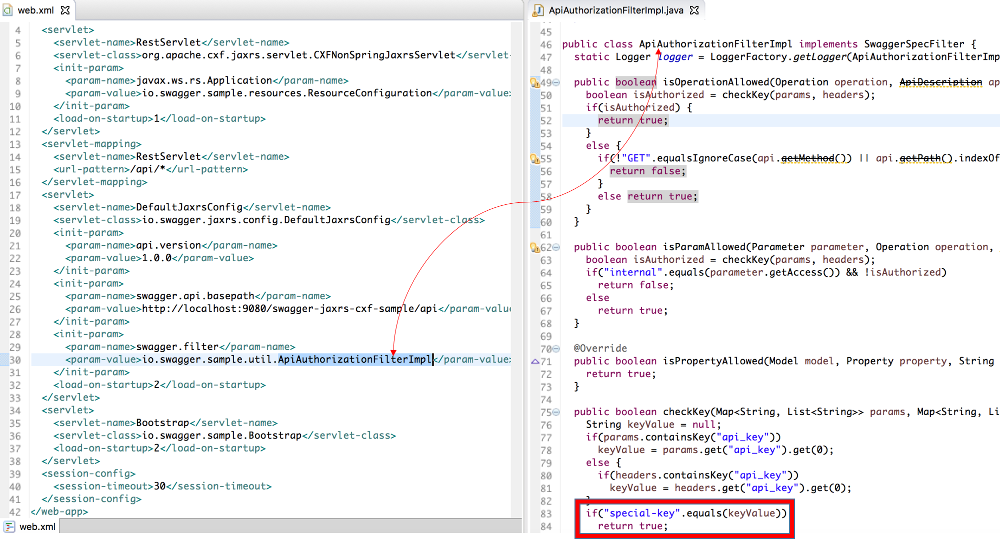

# Swagger Sample App

## Overview
This is a sample (pet store sample) maven project that generates Swagger documentation based Apache CXF servlet and jaxrs-2.0. You can find out more about both the Swagger spec and the framework at http://swagger.io.

This sample is tested with IBM Liberty server. If someone wants to migrate from jaxrs-1.1 to jaxrs-2.0 you can use this sample. 

Liberty provides two Liberty features, jaxrs-1.1 and jaxrs-2.0, to support the JAX-RS programming model. The JAX-RS 1.1 runtime environment from IBM® is driven by a servlet derived from the Apache Wink project. The JAX-RS 2.0 runtime environment is driven by a servlet derived from the Apache CXF 3.0.2. Within the WebSphere® Application Server environment, the lifecycle of servlets is managed in the web container. Therefore, the security services offered by the web container are applicable to REST resources that are deployed in WebSphere Application Server. 

Note:
org.apache.cxf.jaxrs.servlet.CXFNonSpringJaxrsServlet (derived from Apache Wink) is the RestServlet driven in JAX-RS 1.1
com.ibm.websphere.jaxrs.server.IBMRestServlet (derived from Apache CXF 3.0.2) is RestServlet driven in JAX-RS 2.0

### To build (with Maven)
If you have imported this Maven project on the eclipse studio then just right click the project and click on RunAs -> Maven install. You can run the maven command from command prompt as well.

Note: Eclipse should have the Maven Plugin installed. Maven plugin can be installed from http://download.eclipse.org/technology/m2e/releases or from market place.

### Testing the server
You can install the Websphere Application Server liberty using market place.
Once you deploy and run app on the started server, you can navigate to http://localhost:9080/swagger-jaxrs-cxf-sample/api/swagger.json to view the Swagger Resource Listing.

### Using the UI
There is an HTML5-based API tool bundled in this sample--you can view it it at [http://localhost:9080/swagger-jaxrs-cxf-sample/api]. This lets you inspect the API using an interactive UI.  You can access the source of this code from [here](https://github.com/swagger-api/swagger-ui)

### Applying an API key
The sample app has an implementation of the Swagger ApiAuthorizationFilter.  This restricts access to resources based on api-key.  There are two keys defined in the sample app:

<li>- default-key</li>

<li>- special-key</li>

When no key is applied, the "default-key" is applied to all operations.  If the "special-key" is entered, a number of other resources are shown in the UI, including sample CRUD operations.

### Explains the mappings (web.xml - code)

      
      
      

